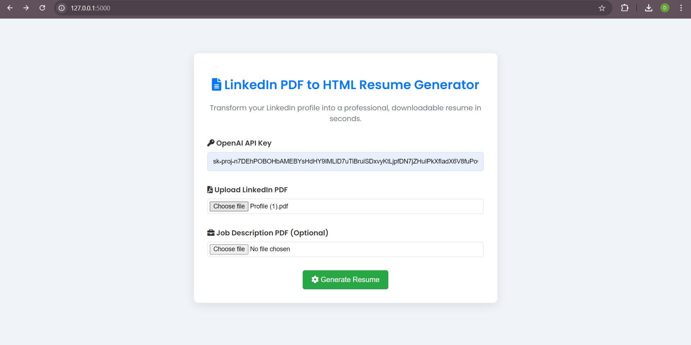

# LinkedIn PDF to HTML Resume Generator

## Description

The **LinkedIn PDF to HTML Resume Generator** is a web application that provides the conversion of LinkedIn PDF profiles into professional, HTML-based resumes. The app integrates with OpenAI’s GPT-4 API for resume generation, with Llama as a backup when OpenAI API credits are exhausted. The application uses prompt engineering with tag-based enhancements to ensure the resumes are well-structured and relevant.

### Key Features

1. **LinkedIn PDF Upload**: Users can upload their LinkedIn profile in PDF format. The application extracts the text for further processing.
   
2. **OpenAI and Llama Integration**: The extracted data is processed using OpenAI’s GPT-4 to generate a structured HTML resume. In case OpenAI API credits are unavailable, the Llama model is used to maintain functionality.
   
3. **Prompt Engineering with Tags**: Advanced prompt engineering is used to guide the AI in crafting optimized resumes, utilizing tags to fine-tune the output for relevance and clarity.
   
4. **ATS-Friendly HTML Output**: The generated resume follows an ATS (Applicant Tracking System) compatible HTML format, ensuring it meets the standards for automated screening tools used by employers.

5. **Fallback Mechanism**: When OpenAI credits run out, the app automatically switches to using the Llama model to maintain continuous service.

### How It Works

1. **Upload LinkedIn PDF**: Users upload their LinkedIn profile as a PDF file.
   
2. **Text Extraction**: The application extracts text from the PDF using tools like PyPDF2 or similar libraries.
   
3. **AI-Powered Resume Generation**: OpenAI’s GPT-4 model processes the text to generate a tailored, ATS-compliant resume. If OpenAI credits are exhausted, the Llama model takes over seamlessly.
   
4. **Optimized Prompt Engineering**: The app applies prompt engineering strategies using specific tags to refine the results and ensure high-quality resumes.

5. **Resume in HTML Format**: The generated resume is saved and provided to users in an HTML format, which can be downloaded and further customized if needed.


## Installation and Setup

### Requirements

- Python 3.6+
- Flask
- PyMuPDF (Fitz)
- OpenAI API Key
- Transformers library for Llama model

### Steps to Run the Application

1. **Clone the Repository**:
   ```bash
   git clone https://github.com/yourusername/linkedin_resume_generator.git
   cd linkedin_resume_generator
   ```

2. **Install Dependencies**:
   ```bash
   pip install -r requirements.txt
   ```

3. **Set Up OpenAI API Key**:
   You need to have an OpenAI API key to use the GPT-4 model for generating the resume. You can get the API key from OpenAI.

4. **Run the Application**:
   ```bash
   flask run
   ```

5. **Access the Application**:
    Open your web browser and navigate to http://127.0.0.1:5000/ to use the application.

### **File Structure**

        .
        └── LinkedIn Profile to HTML Resume Generator/
            ├── app.py
            ├── static/
            │       ├── style.css
            ├── templates/
            │       ├── index.html
            ├── imgs
            ├── README.md
            └── requirements.txt

## Usage

### Home Page:
- Upload a LinkedIn profile PDF.
- Enter your OpenAI API key.
- Optionally, upload a job description PDF to tailor the resume.



### Generate Resume:
- After uploading the necessary files, the app processes the data, extracts text from the PDFs, and uses AI to generate the resume.


### Download Resume:
- Once the resume is generated, you can download the HTML file.


You can find the html resume [here](./resources/resume.html).

## Code Structure

- **`app.py`**: The main application file that handles the routing and business logic.
  - **`/` (Home Route)**: Handles the PDF upload and resume generation process.
  - **`/download/<filename>` (Download Route)**: Provides the generated resume for download.

- **Text Extraction**: Uses PyMuPDF (`fitz`) to extract text from uploaded PDF files.

- **Resume Generation**: Leverages OpenAI's GPT-4 API to generate an ATS-friendly resume in HTML. If OpenAI is unavailable, the app switches to Llama using the Groq client.

## Dependencies

- **Flask**: For web framework and routing.
- **PyMuPDF (Fitz)**: For extracting text from LinkedIn PDFs.
- **OpenAI**: For generating HTML-based resumes using GPT-4.
- **Groq (Llama)**: For fallback when OpenAI API is unavailable.
- **transformers**: For integrating with Llama models.

## Error Handling

- If the OpenAI API call fails, the application automatically switches to using Llama via Groq API.
- Errors related to file handling and API calls are logged, and user-friendly error messages are displayed.
